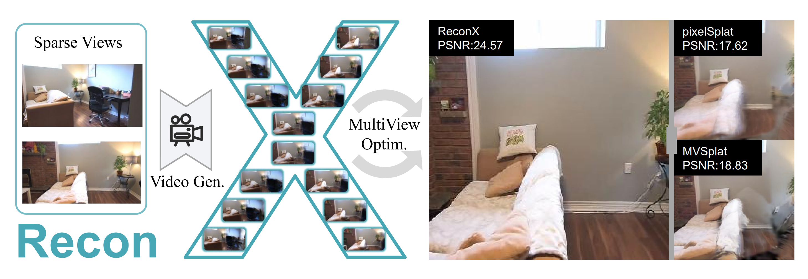
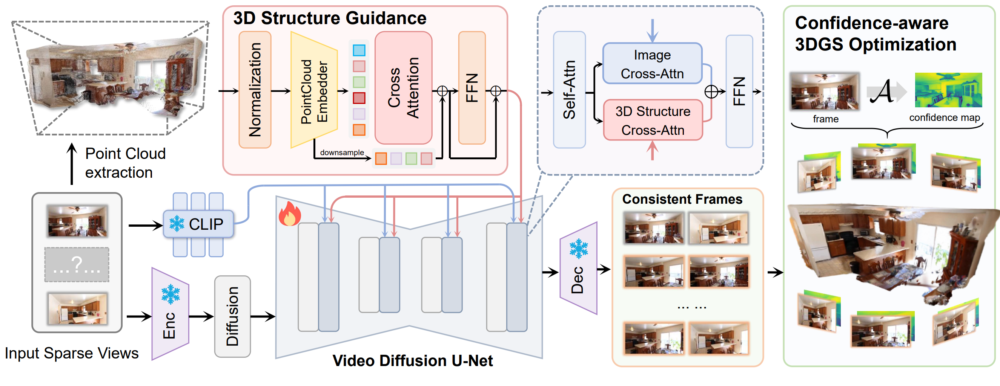

# ReconX: Reconstruct Any Scene from Sparse Views with Video Diffusion Model

[**Paper**](https://arxiv.org/abs/2408.16767) | [**Project Page**](https://liuff19.github.io/ReconX/) | [**Video**](https://youtu.be/UuL2nP5rJcI)

Official implementation of ReconX: Reconstruct Any Scene from Sparse Views with Video Diffusion Model

[Fangfu Liu](https://liuff19.github.io/), [Wenqiang Sun](https://github.com/wenqsun), Hanyang Wang, Yikai Wang, Haowen Sun, Junliang Ye, Jun Zhang, Yueqi Duan.


<p align="center"> All Code will be released soon... 🏗️ 🚧 🔨</p>

Abstract: *Advancements in 3D scene reconstruction have transformed 2D images from the real world into 3D models, producing realistic 3D results from hundreds of input photos. Despite great success in dense-view reconstruction scenarios, rendering a detailed scene from insufficient captured views is still an ill-posed optimization problem, often resulting in artifacts and distortions in unseen areas. In this paper, we propose ReconX, a novel 3D scene reconstruction paradigm that reframes the ambiguous reconstruction challenge as a temporal generation task. The key insight is to unleash the strong generative prior of large pre-trained video diffusion models for sparse-view reconstruction. However, 3D view consistency struggles to be accurately preserved in directly generated video frames from pre-trained models. To address this, given limited input views, the proposed ReconX first constructs a global point cloud and encodes it into a contextual space as the 3D structure condition. Guided by the condition, the video diffusion model then synthesizes video frames that are both detail-preserved and exhibit a high degree of 3D consistency, ensuring the coherence of the scene from various perspectives. Finally, we recover the 3D scene from the generated video through a confidence-aware 3D Gaussian Splatting optimization scheme. Extensive experiments on various real-world datasets show the superiority of our ReconX over state-of-the-art methods in terms of quality and generalizability.*

<p align="center">
    
</p>

## Free Rendering Results
https://github.com/user-attachments/assets/226e82de-ce9e-43d5-b073-dd94bbf14eb8

https://github.com/user-attachments/assets/56f38186-7115-4215-bac6-82b51d5f0dff

https://github.com/user-attachments/assets/11326df6-3e2b-4d33-9263-1fe7e5c9e9d1


## Method

Overall Framework of ReconX. Given sparse-view images as input, we first build a global point cloud and project it into 3D context representation space as 3D structure guidance. Then we inject the 3D structure guidance into the video diffusion process and guide it to generate 3D consistent video frames. Finally, we reconstruct the 3D scene from the generated video through Gaussian Splatting with a 3D confidence-aware and robust scene optimization scheme. In this way, we unleash the strong power of the video diffusion model to reconstruct intricate 3D scenes from very sparse views.
<p align="center">
    
</p>


## BibTeX

```bibtex
@misc{liu2024reconxreconstructscenesparse,
      title={ReconX: Reconstruct Any Scene from Sparse Views with Video Diffusion Model}, 
      author={Fangfu Liu and Wenqiang Sun and Hanyang Wang and Yikai Wang and Haowen Sun and Junliang Ye and Jun Zhang and Yueqi Duan},
      year={2024},
      eprint={2408.16767},
      archivePrefix={arXiv},
      primaryClass={cs.CV},
      url={https://arxiv.org/abs/2408.16767}, 
}
```
